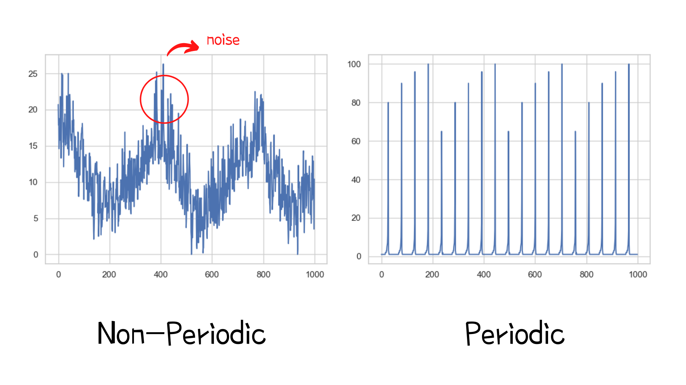
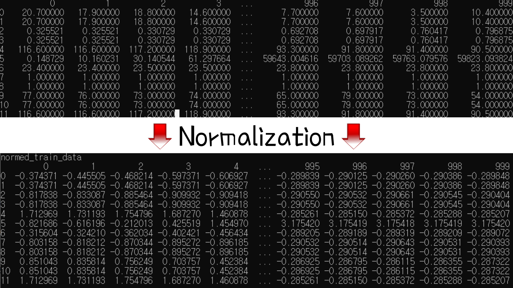
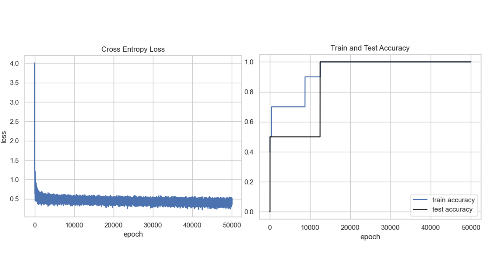

# Time-series Periodic_Classification_LogisticR(PCL) - Summer Intern Research Project(2021) 🕐 📈
PCL(Periodic Classification Logistic) is a binary classification algorithm that utilizes Logistic Regression to classify time series periodicity. We employed Python, Tensorflow, pandas, and NumPy to deploy PCL functionalities. It has labeling, pre-processing, and normalizing methods to predict periodicity effectively. We achieved test accuracy as 1 and train loss below 1 as an output.

## Definition of periodicity
Time-series is divided into two classes, periodc and non-periodc time series. Periodc time series has regular seasonality without noise or pollution. 



## Labeling Time Series
[Step.1] Run main.py in Anaconda virtual environment
```rb
(timeseries_env) C:\Users\taegu\Desktop\인턴자료\PeriodicClassification>python logistic_regression.py
```
[Step.2] Define periodic or non-periodic time series.

[Step.3] Label Time-Series.

If it has periodicity, type
```rb
Type the label(ex: 1- Periodic, 2- Non-Periodic): 1
```

If it has non- periodcity, type
```rb
Type the label(ex: 1- Periodic, 2- Non-Periodic): 2
```

## Normalizing Time Series
Normalizing can unify scale, range, and regularity of time series dataset. 



Normalizing function is below.
```rb
def norm(x, train_stats):
  return (x - train_stats['mean']) / train_stats['std']
```

## Divide into Training and Test set
We separted our dataset into 80% of training and 20% of test time series dataset.
```rb
def dataset_split(X, y):
	seed = 5
	np.random.seed(seed)
	tf.set_random_seed(seed)

	# set replace=False, Avoid double sampling
	train_index = np.random.choice(len(X), round(len(X) * 0.8), replace=False)

	# diff set
	test_index = np.array(list(set(range(len(X))) - set(train_index)))
	train_X = X[train_index]
	train_y = y[train_index]
	test_X = X[test_index]
	test_y = y[test_index]

	train_X = min_max_normalized(train_X)
	test_X = min_max_normalized(test_X)

	print(test_X)

	return train_X, train_y, test_X, test_y
 ```

## Hyperparameters
We use 3 parameters of learning_rate, batch_size, and iteration number.
```rb
learning_rate = 0.003
batch_size = 30
iter_num = 50000 #epoch
```

## Training Model
After the labeling process, it starts training. 
```rb
epoch:  300 loss: 0.720158 train_acc: 0.500000 test_acc: 0.500000
epoch:  600 loss: 0.602131 train_acc: 0.700000 test_acc: 0.500000
.
.
epoch: 9600 loss: 0.480350 train_acc: 0.900000 test_acc: 0.500000
epoch: 9900 loss: 0.588681 train_acc: 0.900000 test_acc: 0.500000
epoch: 10200 loss: 0.555806 train_acc: 0.900000 test_acc: 0.500000
epoch: 10500 loss: 0.477561 train_acc: 0.900000 test_acc: 0.500000
epoch: 10800 loss: 0.468531 train_acc: 0.900000 test_acc: 0.500000
epoch: 11100 loss: 0.496479 train_acc: 0.900000 test_acc: 0.500000
epoch: 11400 loss: 0.447780 train_acc: 0.900000 test_acc: 0.500000
epoch: 11700 loss: 0.385132 train_acc: 0.900000 test_acc: 0.500000
epoch: 12000 loss: 0.517340 train_acc: 0.900000 test_acc: 0.500000
epoch: 12300 loss: 0.426965 train_acc: 0.900000 test_acc: 0.500000
epoch: 12600 loss: 0.459104 train_acc: 1.000000 test_acc: 1.000000
.
.
epoch: 49500 loss: 0.398358 train_acc: 1.000000 test_acc: 1.000000
epoch: 49800 loss: 0.347464 train_acc: 1.000000 test_acc: 1.000000

```

## Evaluate PCL
After the training process, it redirects to visualize loss and accuracy graph. We got test accuracy as 1 and train loss below 1.


## Why accuracy 1?
PCL has two reasons for this. To solve this problem, PCL should train with more dataset along with enough timestamps.
* Low Amount of Dataset: We trained over 12 time-series dataset due to perparation scarcity.
* Short Range of Time Series: We used 1000 timestamps in between series.


